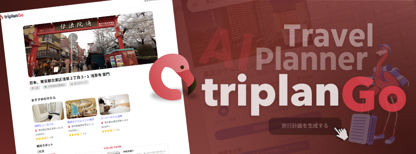
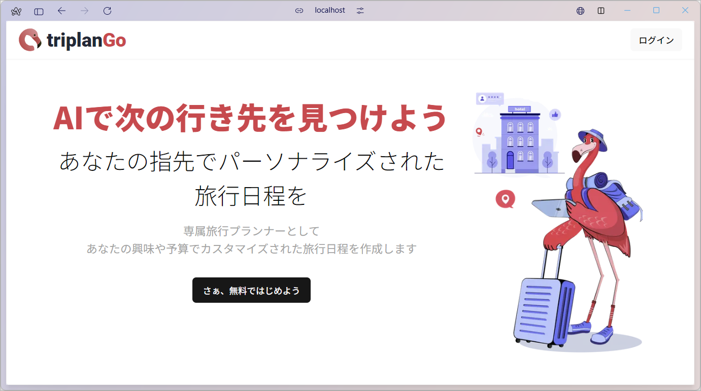
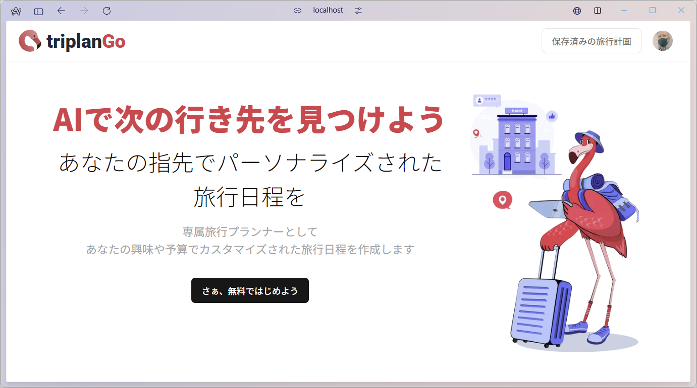
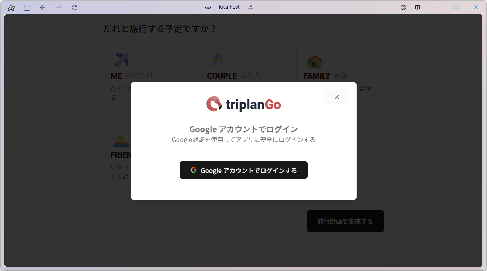
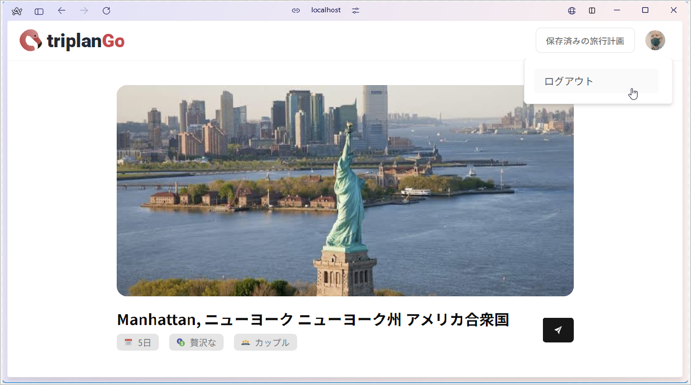
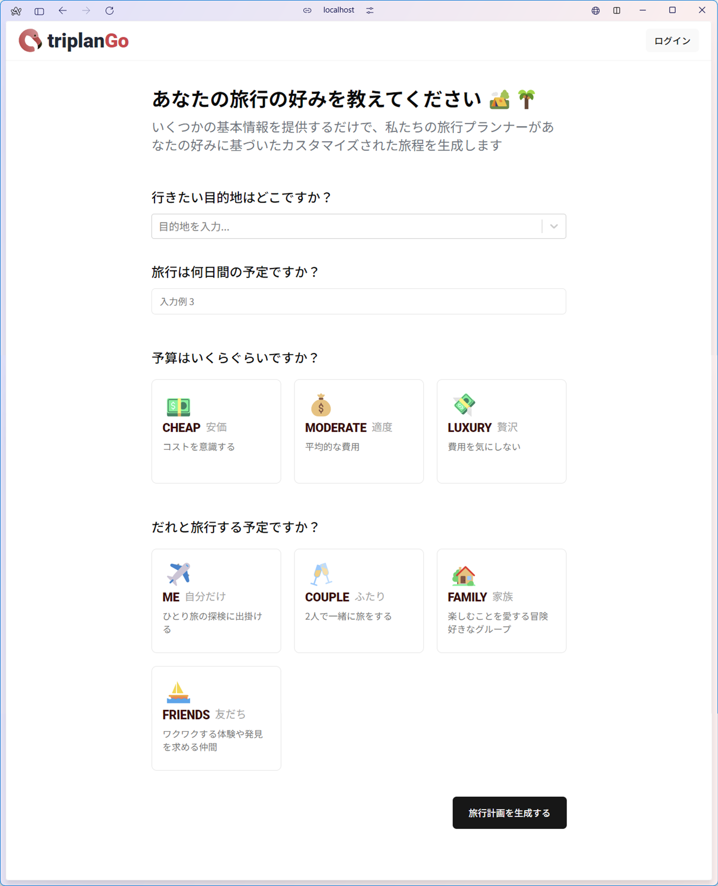
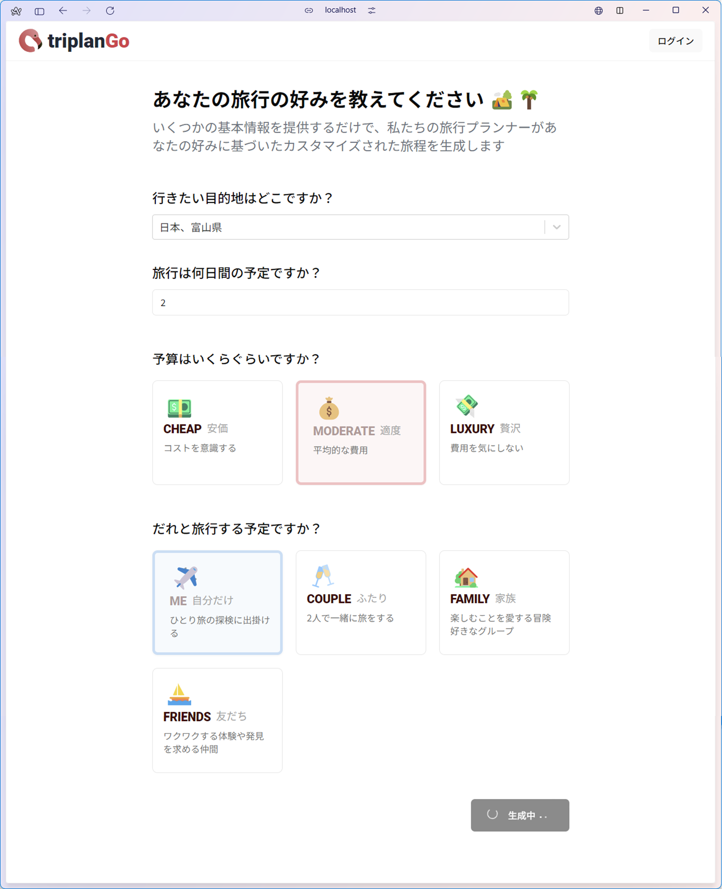
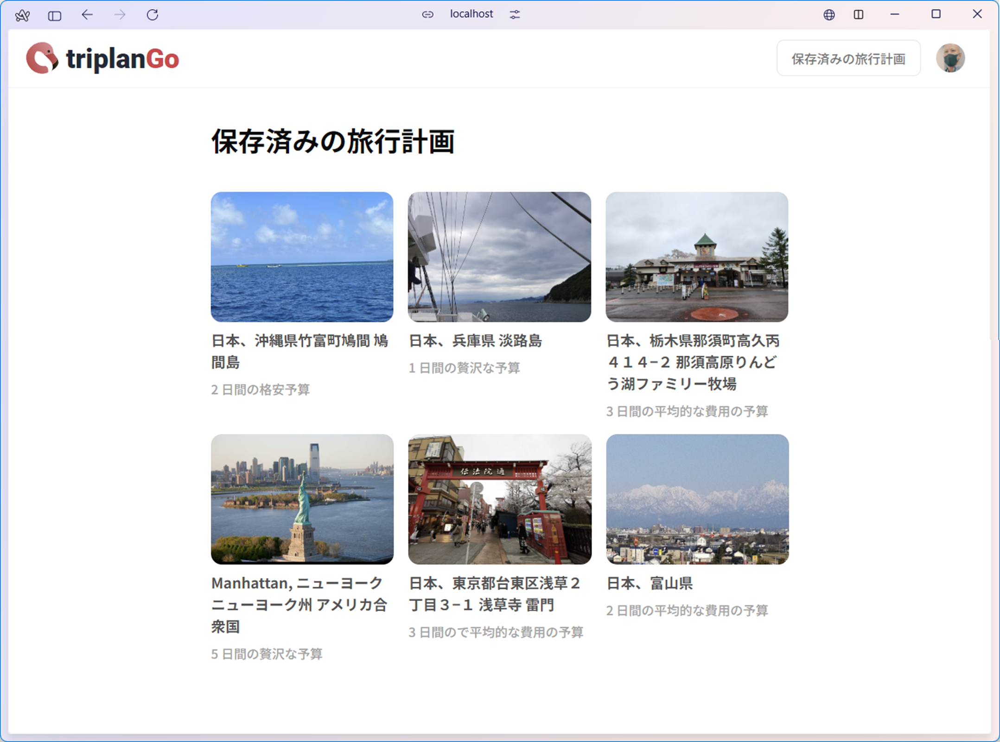
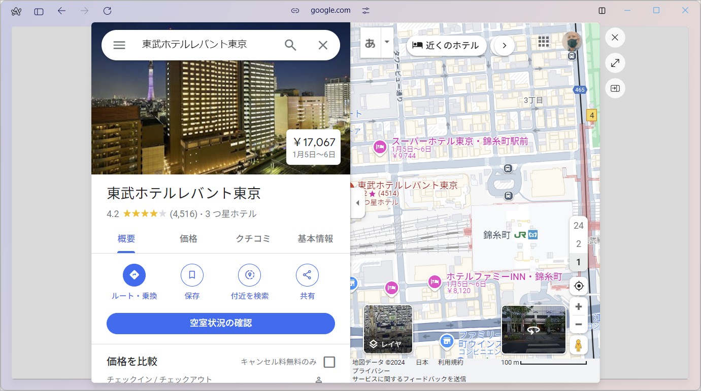
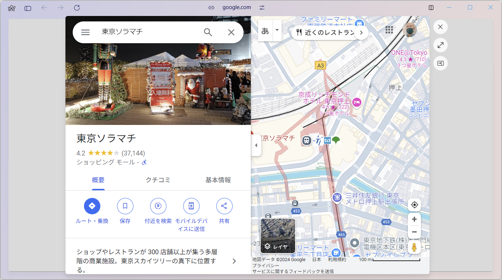

<div align="center">
  <div>
    
    
    
    
    
    
    
    
    
    
    
    
    
  </div>

  <h3 align="center">AI Travel Planner App</h3>

  <div align="center">
    AI が提案する旅行計画を自動生成するアプリ
  </div>
</div>

## 📋 <a name="table">もくじ</a>

1. 🤖 [はじめに](#intro)
2. 🔗 [URL](#url)
3. 💻 [画面一覧](#screen_list)
4. 🚀 [アプリの利用サンプル](#example)
5. 🤸 [終わりに](#outro)

## <a name="intro">🤖 はじめに</a>

あなたの旅行計画作成をサポートするアプリ、triplanGo を紹介します。

triplanGo は、目的地、日数、人数、予算という要望を選択するだけで、すばやく旅行プランを自動生成することができるアプリです。

## <a name="url">🔗 URL</a>

triplanGo | AI Travel Planner    
https://triplango.vercel.app

## <a name="screen_list">💻 画面一覧</a>

```
triplango  
  │     
  ├─　ランディングページ  
  │  
  ├─　ログイン関連  
  │      ログインモーダル  
  │  
  ├─　旅行計画作成ページ  
  │  
  └─　保存済みの旅行計画ページ  
        │
        └─　旅行計画詳細ページ  
```

### ログイン不要画面

#### ランディングページ 

|未ログインの場合|ログイン済みの場合 |
|---|---|
|||

### ログイン関連

```
ログイン関連  
　　ログインモーダル  
```

|ログインモーダル |
|---|
| |

#### ログアウト

##### ヘッダのユーザアバターをクリックしてメニューからログアウト



### 各ページ

```
旅行計画作成ページ  

保存済みの旅行計画ページ  
  │
  └─　旅行計画詳細ページ  
```

#### 旅行計画作成ページ 

|未入力 |入力済み |
|---|---|
| | |

#### 保存済みの旅行計画ページ    



##### 旅行計画詳細ページ  


|ホテル詳細 |スポット詳細 |
|---|---|
|||

## <a name="example">アプリの利用サンプル</a>

### triplanGo 操作デモ

#### 旅行計画を生成する

<!-- ./movies/triplango_create_trip.mp4 -->
<video src="https://github.com/user-attachments/assets/22356df3-e7ff-4667-af96-0820cd24190f" controls="true"></video>

#### 保存済みの旅行計画を見る

<!-- ./movies/triplango_my_trips.mp4 -->
<video src="https://github.com/user-attachments/assets/7be9ded2-7946-47e7-94aa-07f3b9d5118c" controls="true"></video>

## <a name="outro">🤸 おわりに</a>

すばやく旅行プランを自動生成するアプリ triplanGo を紹介しました。

現状の形としては、旅行計画の生成、結果の閲覧のみの機能ですが、内容を編集したり他の人と共有したりする機能を拡充させていけば、より旅行計画を緻密に立てられるアプリになります。
